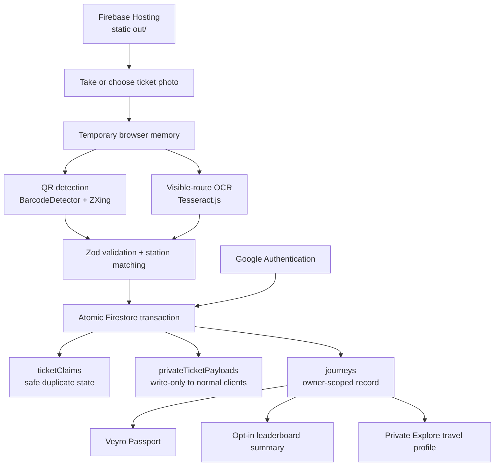
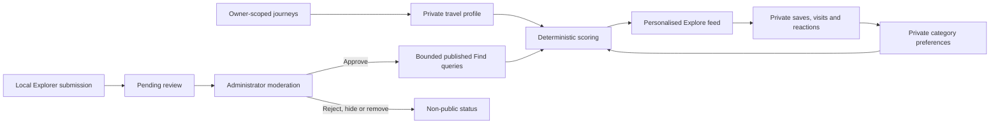

<p align="center">
  
</p>

# Veyro

**Every ride leaves a mark.**

Veyro is a privacy-first public-transport engagement and city-discovery platform for Kochi Metro travellers. It converts a one-time ticket scan into journey progress, Passport insights, community rankings and personalised recommendations around the metro network—without continuously tracking the rider.

**Veyro turns every metro ticket into motivation to travel, explore and participate.**


> Independent traveller-created project. Not affiliated with or endorsed by Kochi Metro Rail Limited.

**Live demo:** No public deployment URL is recorded in this repository. [Run Veyro locally](#local-setup) · **Source:** [github.com/shayen71421/veyro](https://github.com/shayen71421/veyro)

[Demo](#demo-walkthrough) · [Why Veyro](#why-veyro) · [Features](#feature-overview) · [Architecture](#how-veyro-works) · [Privacy](#privacy-by-design) · [Local Setup](#local-setup)

## See Veyro in action

### Product screenshots

No product screenshots are currently committed to the repository. The application can be run locally using the steps below; this section deliberately avoids fake or broken preview images.

<!-- TODO(hackathon-media): Add public/screenshots/dashboard.png showing the signed-in Home dashboard. -->
<!-- TODO(hackathon-media): Add public/screenshots/ticket-verification.png showing a detected route without ticket-private data. -->
<!-- TODO(hackathon-media): Add public/screenshots/passport.png showing station progress and travel insights. -->
<!-- TODO(hackathon-media): Add public/screenshots/explore.png showing the personalised Veyro Finds feed. -->
<!-- TODO(hackathon-media): Add public/screenshots/leaderboard.png showing the three public ranking categories. -->

The user journey is designed around one ticket image:

1. **Sign in with Google.**
2. **Take or choose a ticket photo.**
3. **Veyro reads the QR and visible route locally in the browser.**
4. **Confirm the automatically detected journey—stations cannot be manually edited.**
5. **Build Passport progress, kilometres and streaks.**
6. **Discover Veyro Finds around the metro network.**

## Why Veyro?

Public transport is usually treated as a transaction: buy a ticket, complete a trip and move on. The digital relationship often ends at the gate, leaving little sense of progress, community or discovery around everyday metro use.

Mobility and fitness products can add engagement, but many depend on continuous location tracking. Veyro starts from a ticket-backed journey record instead, giving travellers useful personal insights without following their movement throughout the day.

This creates room for public-transport challenges, station exploration, local discovery and community participation that could serve colleges, employers, events and neighbourhood communities—while remaining clearly separate from official ticketing and passenger systems.

## From ticket transaction to travel habit

Veyro is an engagement layer built around an existing metro ticket:

```text
Ride the metro
      ↓
Scan one ticket
      ↓
Build travel progress
      ↓
Compete and maintain streaks
      ↓
Discover places near the network
      ↓
Contribute Finds after earning trust
```

It does **not** replace Kochi Metro ticketing, metro gates, navigation applications or official passenger systems. Veyro adds motivation, discovery and community around the journey.

## What makes Veyro different?

### Ticket-backed, not GPS-dependent

A rider records a journey from an existing ticket image. Veyro does not continuously track the person or infer their location after the scan.

### One scan, multiple outcomes

The same scan can update journey history, distance, streaks, Veyro Passport progress, leaderboard summaries and the private travel profile used by Explore.

### Explainable city discovery

The personalised Explore feed ranks real Veyro Finds using journey endpoints, route relevance, curated status, community love and the rider's private reactions. It uses deterministic scoring rather than an external AI service.

### Trust earned through travel

Local Explorer access requires at least five journeys and 25 km. Community Finds always begin as pending and require administrator approval before publication.

### Designed for the Firebase free tier

Veyro combines a static Next.js export, browser OCR, bounded one-time reads and Firestore transactions. It needs no billing-dependent application backend, image storage or paid map API.

## Feature overview

| Product area | Implemented capabilities |
| --- | --- |
| **Journey intelligence** | One-photo ticket capture; native camera and image picker; `BarcodeDetector` with ZXing fallback; browser OCR for From and To; validation against 25 operational Kochi Metro stations; route distance and station intervals; duplicate-ticket prevention; private journey history; shareable journey image |
| **Veyro Passport** | Endpoint-based station stamps; network exploration percentage; current and longest streaks; six-month activity; monthly comparisons; personal records; shareable traveller-created recap link |
| **Community leaderboard** | Distance, Journeys and Best Streak only; public top five; personal rank for opted-in users; optional participation; private profile-photo control; deterministic top-five ordering |
| **Veyro Explore** | Personalised For You feed; Finds near frequent routes; Discover Somewhere New; Veyro Curated recommendations; station and category filters; Save; Mark as Visited; Loved It; private Not for Me; Google Maps links; no image uploads |
| **Local Explorer and moderation** | Unlock after five journeys and 25 km; submit real places near verified stations; pending review; administrator approval and rejection; report handling; private research-source records; validated, idempotent seed workflow |
| **Mobile experience** | Mobile-first PWA; native camera/file picker; warm black, bronze and gold design system; GSAP transitions; reduced-motion support; safe-area handling; responsive layout designed for widths from 320 px |

Visited stations in Passport are journey endpoints only. Intermediate stations may improve recommendation relevance, but Veyro never marks them—or a nearby place—as visited automatically.

## Demo walkthrough

This sequence fits a focused hackathon presentation:

1. Open Veyro and continue with Google.
2. Show the Home dashboard, journey totals and the Explore preview.
3. Take or choose a prepared metro ticket image. Development demo mode can alternatively simulate a successful, duplicate or unreadable ticket.
4. Show QR detection, local OCR and automatic route verification.
5. Add the journey and reveal the travel-pass result card.
6. Open Veyro Passport to show station stamps, network coverage, streaks and monthly activity.
7. Open the public leaderboard and switch between Distance, Journeys and Best Streak.
8. Open the personalised Explore feed, explicitly mark a Veyro Find as visited and react with Loved It or Not for Me.
9. With a prepared eligible account, show how a Local Explorer submits a Find that enters pending administrator review.

Demo simulations are application demonstrations, not Metro ticket validation.

## Where Veyro can go next

### Available today

- Google sign-in and protected traveller pages
- One-image QR and route recognition in the browser
- Atomic duplicate protection and private journey history
- Veyro Passport, streaks, records and a shareable recap link
- Opt-in community leaderboards for Distance, Journeys and Best Streak
- Deterministic, personalised Explore recommendations
- Private saves, visits, hides and reactions
- Local Explorer eligibility, pending submissions and administrator moderation
- Researched Veyro Curated seed infrastructure
- Static Firebase Hosting deployment and installable PWA shell

### Future potential

- College public-transport challenges
- Employer sustainable-commute programmes
- Event-based metro campaigns
- Station exploration challenges
- Local business and cultural discovery programmes
- Privacy-conscious ridership engagement across more cities
- Trusted validation through a future official transport-partner integration

These are product opportunities, not claims of current partnerships.

## How Veyro works

Ticket processing and journey creation stay client-side until the final Firestore transaction:



Explore combines bounded public-safe candidates with private, in-browser preferences:



The architecture uses:

- Browser-only ticket image preprocessing, QR detection and OCR
- Firebase Google Authentication
- Cloud Firestore transactions, strict schemas and owner-scoped queries
- Static Next.js export with no Next.js server runtime
- Bounded, one-time reads rather than permanent listeners
- Local Firebase Admin SDK scripts for administration and seeding only

## Privacy by design

| Veyro uses | Veyro does not use |
| --- | --- |
| A ticket image temporarily in browser memory | Continuous GPS tracking |
| Visible route text through local OCR | Ticket image uploads |
| Private Firestore journey documents | Public journey histories |
| Explicit user reactions | Automatic place-visit assumptions |
| Opt-in leaderboard summaries | Public email addresses or Firebase UIDs |
| Validated public Find coordinates | Paid embedded-map tracking |

- Ticket images are never permanently stored or uploaded.
- Raw QR values are never shown in the interface, share cards, URLs, logs, analytics, browser storage or service-worker caches.
- Explore saves, visited-place dates, hidden choices and Not for Me reactions remain private.
- A public Passport recap uses a URL fragment containing validated, safe aggregate data. The fragment is processed in the browser and is not sent to Firebase Hosting.
- Public leaderboard participation is optional. Profile-photo sharing defaults to off.
- Reaching a station does not mean the rider visited a nearby place. A Veyro Find becomes visited only after an explicit **Mark as Visited** action.
- The service worker caches the static application shell, not ticket images, QR values, private interactions, drafts, reports or Firestore responses.

## Security and integrity boundaries

Veyro is not a ticket validator. It does not decode the Metro's internal QR payload, generate tickets, validate gate entry or claim that a journey is an official Metro record. It is an independent project and is not endorsed by KMRL.

The no-cost Spark architecture has no trusted application backend. A modified client can attempt to manipulate the deterministic ticket key, leaderboard summaries, Local Explorer eligibility or engagement counts. Base64URL is reversible encoding—not encryption, hashing or proof that a key matches a raw QR value.

Firestore Rules, exact schemas, ownership mappings, atomic transactions, immutable journey records and mandatory Find moderation reduce ordinary misuse. They cannot make a client-only system cheat-proof. Production-grade verification would require a trusted backend or transport-partner integration.

> Veyro prioritises a deployable no-cost prototype while documenting where a production partnership would strengthen trust.

## Technical stack

| Layer | Technology |
| --- | --- |
| Frontend | Next.js App Router, React, strict TypeScript |
| Styling | Tailwind CSS and the Veyro warm black, bronze and gold design system |
| Motion | GSAP with reduced-motion handling |
| Authentication | Firebase Authentication with Google |
| Database | Cloud Firestore modular client SDK |
| QR | Browser `BarcodeDetector`, `@zxing/browser` and `@zxing/library` |
| OCR | Tesseract.js in the browser |
| Validation | Zod |
| UI utilities | Lucide React, date-fns and html-to-image |
| Hosting | Firebase Hosting serving `out/` |
| Deployment model | Static Next.js export |
| Testing | Vitest and Firebase Local Emulator Suite Rules tests |

The Firebase Admin SDK is a development dependency used only by local administration and seed scripts. It is not imported into the client bundle or deployed to Firebase Hosting.

## Built to run without a billing account

Veyro is deliberately compatible with the Firebase Spark plan:

- Next.js uses `output: "export"` and produces static files in `out/`.
- Firebase Hosting serves the static export without Functions rewrites.
- Authentication uses Google only—no Phone/SMS authentication.
- Ticket images and OCR stay in browser memory.
- Explore cards are text-based; there is no Cloud Storage dependency.
- Google Maps links are generated from coordinates; there is no paid or embedded map API.
- Journey history is paginated and Explore candidate pools are bounded.
- Reads are one-time and session-cached where useful; there are no snapshot listeners.
- Totals and insights are calculated from owner-scoped journey documents instead of editable aggregate counters.

The repository does **not** use Cloud Functions, Firebase App Hosting, Cloud Run, Cloud Storage, API routes, Server Actions, Firebase Extensions, scheduled jobs, external AI APIs or billing-dependent Google Cloud services.

## Keeping Explore useful

The repository currently contains **16 researched seed candidates across 12 operational stations**. The research pass considered 25 candidates and deferred nine where current evidence, credible coordinates, public access or a reasonable station connection could not be established confidently.

Each accepted Veyro Curated candidate has at least two source records in `data/explore-seed-sources.ts`. Public Find documents do not expose those research URLs; the seed script writes them to administrator-only `exploreSourceRecords`.

Community submissions begin as pending. Enabled administrators can approve, reject with a message, hide, restore or remove Finds and review user reports. Users are reminded that prices, hours, access and local conditions may change and should be checked before visiting. All 16 seed-record walking times are deliberately labelled as estimates.

Veyro Curated means researched by this project. It does not mean official Kochi Metro approval.

## Repository structure

```text
app/                    Static App Router pages
components/             Shared UI and product components
features/               Authentication, scanner and journey state/services
lib/                    Firebase, OCR, QR, insights, ranking and Explore logic
data/                   Verified stations and researched Find datasets
scripts/                Local admin, leaderboard and seed tooling
tests/                  Unit and Firestore Rules tests
public/                 PWA manifest, service worker, icons and logo
firestore.rules         Firestore access-control policy
firestore.indexes.json  Required composite query indexes
firebase.json           Hosting, Firestore and emulator configuration
```

## Local setup

### Prerequisites

- Node.js 22+ and npm
- A Firebase project that remains on the Spark plan
- Firebase CLI access through the installed `firebase-tools` package
- A local Java runtime for Firebase Emulator Suite tests

Install and start the application:

```bash
npm install
cp .env.example .env.local
npm run dev
```

Open [http://localhost:3000](http://localhost:3000).

### Environment variables

The committed `.env.example` contains these application variables:

```dotenv
NEXT_PUBLIC_FIREBASE_API_KEY=
NEXT_PUBLIC_FIREBASE_AUTH_DOMAIN=
NEXT_PUBLIC_FIREBASE_PROJECT_ID=
NEXT_PUBLIC_FIREBASE_MESSAGING_SENDER_ID=
NEXT_PUBLIC_FIREBASE_APP_ID=
NEXT_PUBLIC_DEMO_MODE=false
```

These are Firebase web-app identifiers, not administrator credentials. Firestore Security Rules enforce data access. Never commit `.env.local`.

The client also supports two optional settings that are not required in the production template:

```dotenv
NEXT_PUBLIC_USE_FIREBASE_EMULATORS=true
NEXT_PUBLIC_OCR_CONFIDENCE_THRESHOLD=0.72
```

Keep the OCR threshold at or above the Rules-enforced minimum unless the Rules and validation model are deliberately reviewed together.

### Firebase project setup

1. Create or select a Firebase project without upgrading it from Spark.
2. Register a Web app and copy its public configuration into `.env.local`.
3. In **Authentication → Sign-in method**, enable Google. Keep Email/Password and Phone disabled.
4. Add the Hosting domain and required local development hosts to Authentication's authorised domains.
5. Create Cloud Firestore.
6. Copy `.firebaserc.example` to `.firebaserc` and select the intended project:

   ```bash
   cp .firebaserc.example .firebaserc
   npx firebase login
   npx firebase use --add
   ```

7. Deploy the Rules and composite indexes:

   ```bash
   npx firebase deploy --only firestore
   ```

No Firebase Storage bucket, Cloud Function, App Hosting backend or phone provider is required.

### Local Emulator Suite

In one terminal:

```bash
npx firebase emulators:start --only auth,firestore
```

In `.env.local`, set `NEXT_PUBLIC_USE_FIREBASE_EMULATORS=true`, then restart:

```bash
npm run dev
```

The emulator configuration uses Authentication on port `9099`, Firestore on `8080` and the Emulator UI on `4000`.

### Static build and Firebase Hosting

```bash
npm run build
npx firebase deploy --only hosting
```

`npm run build` runs the static Next.js production build and generates `out/`. `firebase.json` serves that directory, applies immutable caching to hashed Next.js assets, disables long-lived caching for `sw.js` and contains no Functions rewrite or App Hosting configuration.

## Demo mode

Set the following in `.env.local` and restart the development server:

```dotenv
NEXT_PUBLIC_DEMO_MODE=true
```

The scanner then exposes existing development controls for:

- Successful scan
- Duplicate ticket
- Unreadable route

Demo mode also provides local demonstration data for selected screens. It is never enabled automatically, does not validate a Metro ticket and must remain `false` in production.

## Administrator and seed setup

<details>
<summary>Administrator and Explore seed setup</summary>

### Credential safety

Administrative scripts run locally through the Firebase Admin SDK. Prefer a service-account file stored outside the repository:

```bash
export GOOGLE_APPLICATION_CREDENTIALS="/absolute/private/path/service-account.json"
export FIREBASE_PROJECT_ID="your-project-id"
```

The scripts can alternatively use the currently authenticated Firebase CLI account after:

```bash
npx firebase login --reauth
```

Project selection comes from `FIREBASE_PROJECT_ID`, `GOOGLE_CLOUD_PROJECT` or `.firebaserc`. Never expose administrator credentials through a `NEXT_PUBLIC_*` variable.

The repository ignores:

- `service-account*.json`
- `firebase-admin-key*.json`
- `*-firebase-adminsdk-*.json`

Never commit, print or copy service-account contents into the application.

### Grant or revoke an administrator

There is no public Become Admin control or client-side email allowlist. Administration is determined by `admins/{uid}`:

```bash
npm run admin:grant -- --uid=<FIREBASE_UID>
npm run admin:revoke -- --uid=<FIREBASE_UID>
```

Granting creates or updates an enabled protected administrator record. Revoking sets `enabled: false` without deleting journeys, submissions or interactions.

### Validate and seed Veyro Curated Finds

Validate the dataset without credentials:

```bash
npm run explore:seed:validate
```

Run the credentialed dry run; this performs no writes:

```bash
npm run explore:seed:dry -- --uid=<ENABLED_ADMIN_UID>
```

Apply only after reviewing the research report and dry-run output:

```bash
npm run explore:seed:apply -- --uid=<ENABLED_ADMIN_UID>
```

Apply mode requires an enabled administrator, uses batched writes and is idempotent and `seedVersion`-aware. It creates or updates:

- `exploreFinds/{findId}` with public-safe Veyro Curated content
- `exploreFindOwners/{findId}` with the private administrator ownership mapping
- `exploreSourceRecords/{findId}` with administrator-only evidence

To add or reverify a curated Find:

1. Confirm the place, coordinates, access and station proximity using current reliable sources.
2. Update both `data/explore-seed.ts` and `data/explore-seed-sources.ts`.
3. Update `data/explore-seed-report.md` and the verification date.
4. Increment the record's `seedVersion`.
5. Run validation, dry run and then an intentional apply.

### Optional showcase leaderboard seed

For a controlled hackathon demonstration:

```bash
npm run seed:leaderboard
```

This command writes ten deterministic synthetic showcase profiles to the selected Firestore project. It uses the local Firebase CLI session, is not part of the browser bundle and is idempotent by deterministic IDs. Synthetic email addresses remain inside protected user documents and are not published in leaderboard entries.

Review the selected Firebase project before running any seed command.

</details>

## Firestore privacy model

<details>
<summary>Collections, ownership and public-safe data</summary>

### Ticket-backed journeys

- `users/{uid}` stores the private account profile and optional private leaderboard ID.
- `journeys/{journeyId}` stores an immutable, owner-scoped journey.
- `ticketClaims/{ticketKey}` stores only `claimed` and `createdAt`; authenticated users may perform a known-document get, but listing is denied.
- `privateTicketPayloads/{ticketKey}` stores the unchanged raw QR and ownership/route references; all normal-client reads, listings, updates and deletes are denied.

The claim, private payload and journey must be created atomically.

### Leaderboard

- `leaderboardOwners/{leaderboardId}` privately maps a random public UUID to its owner and cannot be publicly listed.
- `leaderboardEntries/{leaderboardId}` contains only visibility, public display name, optional enabled photo, total journeys, total distance, longest streak, version and timestamps.
- The public entry never contains a Firebase UID, email, ticket data, journey ID, route or exact journey timestamp.
- Leaving the leaderboard sets `visible: false` and does not delete private journeys.

Top-five queries are cached one-time `limit(5)` reads. Secondary fields deterministically order the top five. Public positions use competition rank by primary metric, so a tie can display as `1, 2, 2, 4`.

### Explore

- `exploreFinds/{findId}` contains public-safe content, station, coordinates, author badge, moderation state and love count.
- `exploreFindOwners/{findId}` is the protected ownership mapping.
- `users/{uid}/exploreSubmissions/{findId}` is the contributor's private status and moderation message.
- `users/{uid}/exploreInteractions/{findId}` stores private saves, visits, hides and reactions.
- `exploreReports/{reportId}` stores private moderation reports.
- `exploreSourceRecords/{findId}` stores administrator-only research evidence.
- `exploreEligibility/{uid}` stores the owner's client-calculated eligibility snapshot.
- `admins/{uid}` stores the protected administrator role and enabled state.

Only Loved It affects the public `loveCount`, and only after an explicit visit. Not for Me has no public counter. A Firestore transaction keeps the private reaction and public count change together.

</details>

## Raw QR handling and duplicate prevention

The product requirement stores the complete, unchanged raw QR value without hashing. Before submission, the browser trims only accidental outer whitespace and validates a UTF-8 length of 8–700 bytes.

The browser then Base64URL-encodes those UTF-8 bytes to create `ticketKey`. **Base64URL is reversible encoding—not encryption or hashing.** The raw value itself is written only to `privateTicketPayloads/{ticketKey}`.

The transaction reads only `ticketClaims/{ticketKey}`. If unused, it atomically creates the safe claim, private payload and journey. Reusing the same normal client-generated key returns:

> This ticket has already been added to Veyro. A ticket can only be used once.

The UI, exported journey image, Passport recap, URLs, logs, analytics, local storage, session storage, IndexedDB, Cache Storage and service worker never receive the raw QR. The ticket image is cleared from memory after processing and is never uploaded.

### Spark-only duplicate limitation

Because the deterministic key is generated by client code, a person who modifies that client can deliberately submit a different key. Firestore Rules cannot derive Base64URL from arbitrary UTF-8 text to prove the relationship. Duplicate prevention is reliable for normal application usage, but it is not completely tamper-proof.

A production system would derive and validate the key in a trusted backend. Veyro deliberately does not add Cloud Functions or another paid backend as a workaround.

## OCR and browser limitations

Tesseract.js runs locally after image upscaling and grayscale/contrast preprocessing. Veyro supports:

- Labelled paper tickets using `From:` and `To:`
- Mobile routes using `→`, `->`, `>` or `TO`
- Mobile layouts where the graphical arrow separates the two station labels

Results below the default `0.72` confidence threshold require a rescan. From and To cannot be manually corrected. Glare, blur, low resolution, aggressive image compression, unusual fonts or uncached OCR assets can prevent recognition.

QR detection, uncached OCR dependency loading, duplicate checks and journey submission require an internet connection. Veyro never queues ticket data for background synchronisation.

## Testing

Run the complete verification sequence:

```bash
npm run typecheck
npm run lint
npm test
npm run test:rules
npm run build
```

The suites cover:

- Operational station order, uniqueness, aliases and route-distance integrity
- Paper and mobile-ticket OCR parsing
- Journey, Passport, streak and monthly calculations
- Passport fragment validation
- Leaderboard ordering, tie handling and safe public data
- Local Explorer eligibility and deterministic Explore personalisation
- Save, visit, reaction and love-count transitions
- Curated seed integrity, sources, coordinates and station coverage
- Firestore authentication, ownership, immutability, private collections, moderation and atomic writes
- Static production export generation

The repository does not define a separate Markdown-lint script.

## Kochi Metro data and attribution

The station dataset contains **25 operational stations** in route order. Names, coordinates and route distances come from KMRL's official GTFS open-data feed, with the published `shape_dist_traveled` values normalised so Aluva is 0 km. The dataset is cross-checked against KMRL's station page and project report; source URLs and access dates are recorded in `data/kochi-metro-data-sources.ts`.

Contains data provided by Kochi Metro Rail Limited. Dataset use does not imply KMRL endorsement of Veyro.

## Roadmap

All items below are future work.

### Product

- Organisation and campus mobility challenges
- Badges, campaign goals and station exploration events
- Broader station coverage for researched Veyro Finds
- Multi-city public-transport support

### Trust

- Trusted backend ticket-key validation
- Official transport-partner integration
- Stronger abuse controls for public statistics and engagement
- Expanded content-verification workflows

### Experience

- Better verified accessibility metadata
- Optional Find images under a future privacy-conscious storage model
- Better offline discovery for already public, non-sensitive content
- Multilingual interfaces
- More accessible Explore filters

## Closing

**Veyro demonstrates that public transport can be more than a transaction. It can become a habit, a community and a way to discover the city.**

Built by [Shayen Thomas](https://github.com/shayen71421).

Veyro is an independent traveller-created project, not an official Kochi Metro application. Metro station data is attributed to Kochi Metro Rail Limited; Veyro Curated and community recommendations remain independent and should be checked for current access, prices and opening hours.
